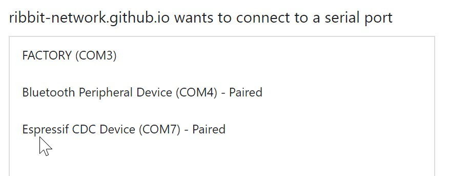
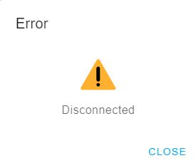

# Software

In order for your Frog to be useful, you'll need to install some software first. 
For this step you will need the following:

- Computer

- Cable to connect the esp32 board.  One end must be USBC for the esp32 board.

## Notes on the cable 

Make sure your cable does support data. many USB cable are for charging only. example of a cable you can use: https://www.amazon.com/dp/B0794M53HQ?ref=ppx_yo2ov_dt_b_product_details&th=1 -- one way to verify your cable is of the correct type: as soon as you plug in the ESP32 your computer (PC or Mac) should detect a new hardware and prompt you for installing drivers if missing. Another hint that you have the correct cable: the JTAG serial port should be listed when you hit the CONNECT button (see next step)

## Install the Software on your Frog

Connect the esp32 board to your computer using the USBC connection port on the esp32 and a cable that will connect to your computer.  

Press and hold the "boot" button then press the "reset" button and release both at the same time (shown below). This puts the esp32 into a flashing mode.

The lights on the board may stop blinking and turn off.


Vist this page https://ribbit-network.github.io/ribbit-network-frog-software/ to install the latest software.

Hit the "CONNECT" Button


You will see a pop-up window like the one shown below. There should be an option labeled USB JTAG. Select that and hit connect.  


Your screen should now show the following: 


Hit the install button and your Frog sensor will get it's software installed.


Once the installation is complete, you should see the following:


Congrats your software is now installed!

## Configure Wifi Connection

In order for your Frog Sensor to connect to the internet, you will need to tell it what Wifi Credentials to use.

First, unplug and replug in your Frog. You should see lights start to flash on your board.

Hit the "CONNECT" button again and you should now see an option labeled "Ribbit Frog Sensor V4" (if on a Mac) or "Expressif CDC Device" (if on windows).




Hit connect and then select the Connect to Wifi option. The Frog will now scan for wifi networks. Select the correct network and enter your password in the form. This password is stored securely on your Frog and will be remembered, so your Frog can always connect to the internet, receive updates, and transmit data.


Once the connection is successful, you see the success message. 


## Connect the Frog to our "Fleet" of Frogs

In order for your Frog to join the Ribbit Network "Fleet" we need to tell it a name and password so that it can securely connect. 


### Get Credentials

First, reach out to the Ribbit Network Core team in Discord ([Join the Developer Discord](https://discord.gg/vq8PkDb2TC)) and send Keenan Johnson a message in the #build-a-sensor channel. He will get you a set of credentials you can use in the next step. The team is working hard to make this self service soon :).

### Find the IP address of your Frog
Vist this page https://ribbit-network.github.io/ribbit-network-frog-software/ and reconnect to your frog.

click the "Visit Device" button


This will take you to a website that is hosted on your esp32 board. Take note of the IP address (example:192.168.86.128) shown in the address bar, as you will need that next.


### Send the credentials to your Frog

Copy the following command below and paste it into a text editor (notepad or something similar).  Update it with your IP address you noted above and the username and password given to you by the Ribbit Network team.  Then copy the edited command.

#### Linux / OSX

```bash
curl http://192.168.86.92/api/config -X PATCH -H "Content-Type: application/json" -d '{"golioth.user": "<your device ID>", "golioth.password": "<your device PSK>"}'
```

#### Windows

```bash
curl http://192.168.86.92/api/config -X PATCH -H "Content-Type: application/json" -d "{\"golioth.user\": \"<your device ID>\", \"golioth.password\": \"<your device PSK>\"}"
```

Note for Windows you need to include the slashes in front of some of the quotation marks as shown above. Example complete command:

```bash
curl http://192.168.86.92/api/config -X PATCH -H "Content-Type: application/json" -d "{\"golioth.user\": \"123456789\", \"golioth.password\": \"top_secret\"}"
```

Open a termainl program on your computer ("Terminal" on Mac or "CMD" on windows), paste the command that you edited above with your correct IP address and credentials into the terminal and hit enter. This will send the command to your Frog configuring the credentials. At this point, the Ribbit Network software team can verify your device connection. Message Keenan in discord.

Note: curl should be installed on most linux, mac, or windows computers.

Leave your frog connected and wait a few minutes.  When complete, a disconnected error will show up on the frog connection page.



Now unplug your frog, let it power down, then plug in again.  Open your browser and type in your frog IP address.  You should be able to see a connection status.  (note: the GPS will not connect if inside a building)


## Complete

Well done! Now you can disconnect your board from the computer and begin the physical assembly.

## Next Step

[Assembly](../4-assembly/4-assembly.md)

## Table of Contents

[Return to the Beginning](../index.md)

## Need Help?

No problem! The Ribbit Network team is here for you! We have lots of ways to connect. Jump in and ask your question or provide a suggestion!

* [Start a discussion here](https://github.com/Ribbit-Network/ribbit-network-frog-software/discussions/new)
* [Join the Developer Discord](https://discord.gg/vq8PkDb2TC)
