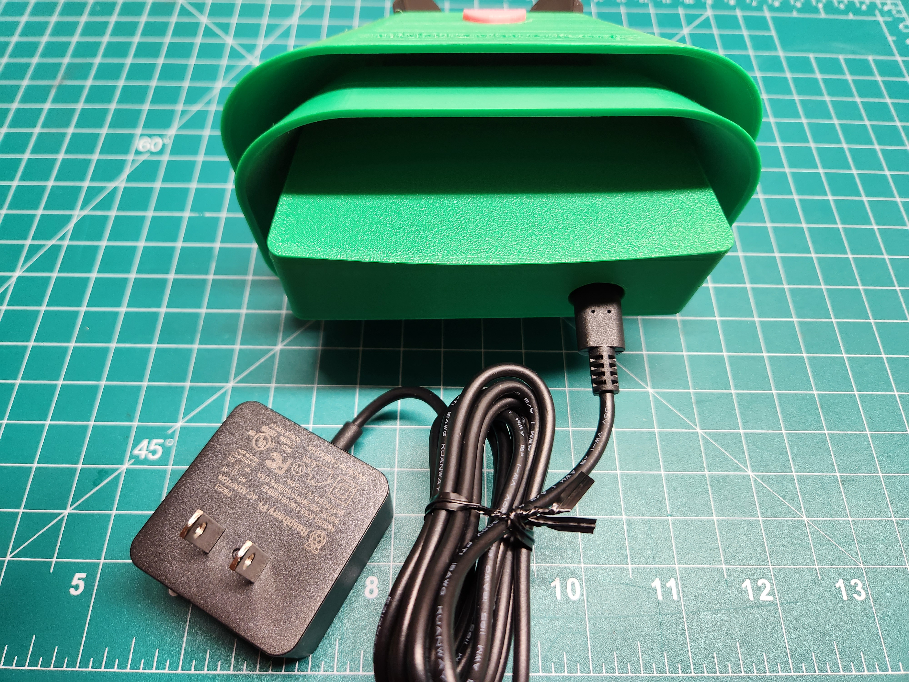
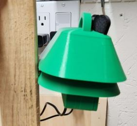
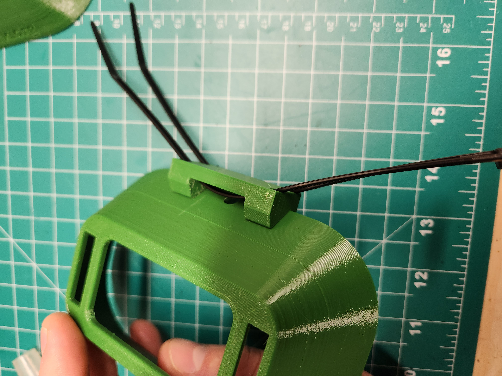
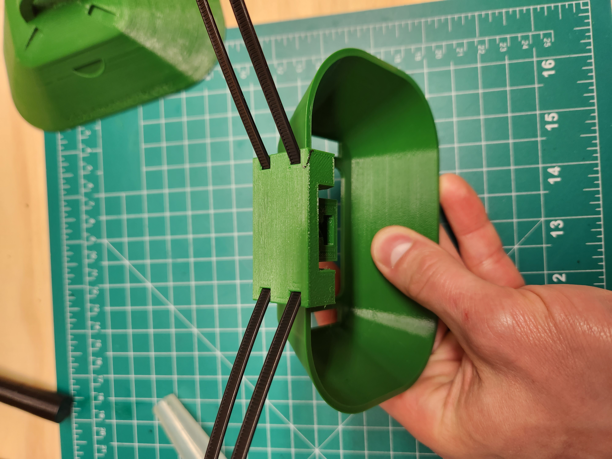

# Sensor Placement

Now it's time to place the sensor in its home outside your home.

You can use the loop on the top of the sensor to hang the sensor somewhere or use the slot on the backside to hang the sensor on a nail.  There are also two accessory hooks that can be used to making haning easier.

The location will need to be near a power outlet to ensure there is power for the sensor. Ideally it should be as high as possible and out of direct sunlight as much as possible to prevent rapid temperature changes. Try to ensure the space above the sensor is largely unobstructed so that the GPS unit can obtain an accurate position (don't place the sensor in a shed for instance).

## Power Cable

Connect the USBC power supply to the USBC connector through the bottom of the enclosure and plug the sensor into a normal wall outlet. If your USBC power supply is connected to an extension cord, you may want to protect that connection from the weather in an enclosure. Search online for weatherproof extension cord covers, outdoor electrical boxes, or build your own out of a waterproof container. Make sure that all the cables enter through an opening in bottom of the enclosure so that water can’t collect inside.

The power cable can be routed through the bottom:

## Hanging

The Frog Sensor can be hung using the loop on top, or the nail hook on the back.  

## Additional Hanging Options

We have also created different hanging accessories to make hanging your sensor even easier.  These can be found in [3D Printing](../2-3d-printing/2-3d-printing.md). There are currently two additional options that can be printed:

First is the S-hook:

Second is the post mount hanger:
Use the zip ties to strap around a post and secure in place.

## Next Step

[View the data!](../6-done/6-done.md)

## Table of Contents

[Return to the Beginning](../index.md)

## Need Help?
No problem! The Ribbit Network team is here for you! We have lots of ways to connect. Jump in and ask your question or provide a suggestion!
* [Start a discussion here](https://github.com/Ribbit-Network/ribbit-network-frog-sensor/discussions/new)
* [Join the Developer Discord](https://discord.gg/vq8PkDb2TC)
* [Email](mailto:keenan.johnson@gmail.com)
